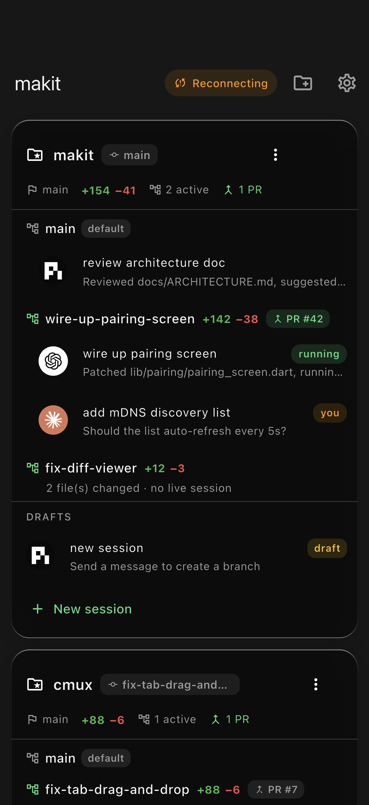
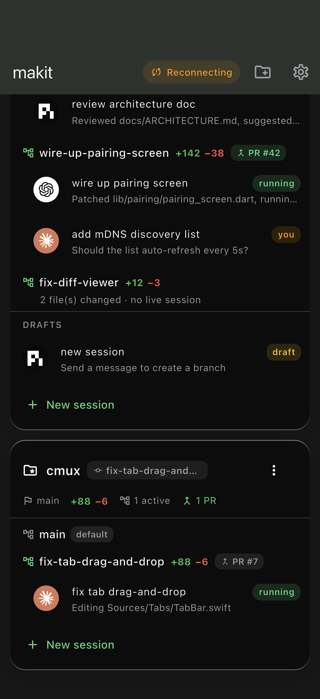
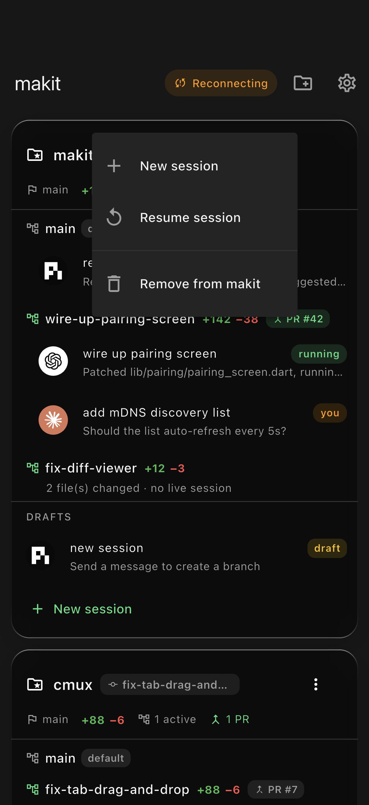

# SPEC-11 — Repo-centric mobile home (worktrees, diff stats, PRs)

**Status:** Implemented · **Depends on:** SPEC-05 (session spawning), SPEC-06 (composer)
**Roadmap:** new — evolves the home screen's information architecture

**Touches (new):**
`server/src/git.ts`,
`server/src/git.test.ts`

**Touches (edit):**
`server/src/protocol.ts` (`RepoDTO` / `WorktreeDTO` / `PullRequestDTO`, `SessionDTO.pending`, `repo.refresh`),
`server/src/manager.ts` (`spawnPendingSession`, `startPendingSession`, `listRepos`),
`server/src/session.ts` (`pending` / `branch` / `worktreePath`, `markStarted`),
`server/src/server.ts` (`session.spawn` → draft, deferred start on first `send.message`, `repos.snapshot`, `repo.refresh`),
`server/src/manager.test.ts`,
`app/lib/store/models.dart` (`RepoInfo` / `Worktree` / `PullRequest`, `Session.pending`),
`app/lib/transport/codec.dart` (`ReposSnapshot`),
`app/lib/store/store.dart` (`reposProvider`, `refreshRepos`),
`app/lib/store/fake_server.dart` (repo snapshot + draft flow for the dev loop),
`app/lib/ui/home/home_screen.dart` (repo cards),
`app/test/home_screen_test.dart`

---

## Goal

Reframe the mobile home screen from **folder-centric** (`Project → Sessions`) to
**repo-centric** (`Repo → Worktree(branch) → Session(s)`). A developer opening
the app should see, per repo, at a glance:

- the **current** and **default** branch,
- the **active worktrees** (feature branches) and how big each change is
  (**+insertions / −deletions**, files changed),
- whether a branch has an **open pull request**,
- the **sessions** running in each worktree — and a single worktree may host
  **multiple agents** (pi, codex, claude) at once.

Starting a new session **creates a git worktree**. Because a good branch name
only exists once the user states an actual task, worktree + agent creation is
**deferred until the first substantive message** (a *draft* session in the
meantime).

**Non-goals (explicit YAGNI):**
- No auto-deletion of worktrees on session quit — work on disk is never
  discarded implicitly (a manual "discard worktree" action can come later).
- No in-app PR review/merge — the PR badge is informational (a tappable
  deep-link to the PR URL is a follow-up).
- No new persistence format — `RepoDTO` is computed on demand from git, not
  stored.

## Consensus decisions (source of truth)

1. **A repo is the existing `Project`** (a registered directory). Repo
   intelligence is layered on top via git, not a new registration concept.
2. **New session = new branch = new worktree.** One draft per "New session"
   tap.
3. **Worktree base dir is configurable**, `MAKIT_WORKTREE_DIR`, default
   `~/.worktrees/<repo-name>/<branch>`.
4. **Names are auto-generated from the first real request** (slugified), with a
   generic `session-<id>` fallback for empty/smalltalk input.
5. **Deferred creation:** `session.spawn` yields a *pending* session with no
   worktree and no agent process; the first `send.message` materializes the
   worktree + agent, then delivers the message.
6. **Git/gh are best-effort.** A repo with no upstream, a detached HEAD, or a
   missing/unauthenticated `gh` degrades gracefully (null / zeroed) — the home
   screen must always render.

## The deferred-worktree state machine

```
spawn (draft)                first substantive send.message
   │  pending=true                    │
   ▼                                  ▼
[ DRAFT ] ──────────────────► [ LIVE in worktree ]
 no worktree                   branch = slug(first message)
 no agent process              worktree = MAKIT_WORKTREE_DIR/<repo>/<branch>
 DetachedAdapter placeholder   agent started with cwd = worktree
 shows in "DRAFTS"             sessionIds attached to the worktree
```

- **Idempotent:** `startPendingSession` on an already-live session is a no-op
  returning the same session (no second worktree/agent).
- **Non-git projects:** the agent runs in the repo dir itself (no worktree),
  so the feature degrades to today's behavior.
- **Branch uniqueness:** collisions append `-2`, `-3`, … before
  `git worktree add -b`.

## Wire protocol (mirror: `protocol.ts` ↔ `protocol.dart`/`codec.dart`)

New event frame `repos.snapshot` (broadcast on connect, spawn, session start,
kill, project add/remove, and explicit `repo.refresh`). **Not** emitted per
session event — it shells out to git/gh, so it is an occasional operation.

```jsonc
{ "kind": "repos.snapshot", "repos": [ RepoDTO ] }

RepoDTO {
  id, name, path, pinned, lastActivityAt,
  isGitRepo: bool,
  defaultBranch: string|null,   // origin/HEAD → main → master → current
  currentBranch: string|null,   // null when detached
  worktrees: [ WorktreeDTO ]
}

WorktreeDTO {
  id, path, branch: string|null, isPrimary: bool,
  insertions, deletions, filesChanged,   // vs defaultBranch (committed + working + untracked)
  pr: PullRequestDTO|null,               // via `gh pr list --head <branch> --state open`
  sessionIds: [string]                   // live (non-draft) sessions in this worktree
}

PullRequestDTO { number, url, state, title, isDraft }
```

`SessionDTO` gains: `pending: bool`, `branch?: string`, `worktreePath?: string`.

New `cmd` kind `repo.refresh` → recompute + rebroadcast `repos.snapshot`
(drives pull-to-refresh).

## Server design (`git.ts`)

Thin, promise-returning wrappers over the `git`/`gh` CLIs; every read helper is
best-effort (never throws), `addWorktree` is the one mutation whose error the
caller surfaces.

| Function | Command | Notes |
|----------|---------|-------|
| `isGitRepo` | `rev-parse --is-inside-work-tree` | |
| `detectDefaultBranch` | `symbolic-ref origin/HEAD` → `main`/`master` → current | null only if no branches |
| `detectCurrentBranch` | `rev-parse --abbrev-ref HEAD` | null when detached |
| `listWorktrees` | `worktree list --porcelain` | first entry = primary |
| `diffStat` | `diff --numstat base...HEAD` + `diff --numstat HEAD` + `ls-files --others` | committed + uncommitted + untracked |
| `findOpenPr` | `gh pr list --head <branch> --json …` (5s timeout) | null if gh missing/unauthed/no remote |
| `slugify` | — | kebab-case, ≤6 words, git-safe |
| `addWorktree` / `removeWorktree` / `branchExists` | `worktree add -b` / `worktree remove` / `rev-parse --verify` | |

`worktreeBaseDir()` reads `MAKIT_WORKTREE_DIR` (default `~/.worktrees`).

`SessionManager`:
- `spawnPendingSession(projectId, agent?)` — draft session, `DetachedAdapter`
  placeholder, `pending=true`.
- `startPendingSession(sessionId, firstMessage)` — slug → `addWorktree` off the
  default branch → build + start the real adapter with `cwd = worktree` →
  `session.markStarted({branch, worktreePath, title})`.
- `listRepos()` — per project: branches + worktrees enriched with `diffStat`,
  `findOpenPr` (feature branches only), and the live sessions grouped by
  `worktreePath` (draft sessions excluded — surfaced separately by the UI).

`server.ts`: `session.spawn` → `spawnPendingSession`; `send.message` starts a
pending session before relaying the text (surfacing worktree-creation failure
as a `session.error`), then broadcasts `repos.snapshot`.

## Client design (`app/`)

- Models `RepoInfo` (with `totalInsertions/Deletions`, `activeWorktreeCount`,
  `openPrCount`), `Worktree` (`hasChanges`), `PullRequest`; `Session` gains
  `pending` / `branch` / `worktreePath`.
- `WireCodec` decodes `repos.snapshot`; the store keeps `repos`, exposes
  `reposProvider`, and `refreshRepos()` sends `repo.refresh`.
- `home_screen.dart` — a `RefreshIndicator` over **repo cards**:
  - **header:** repo name + current-branch chip + overflow menu (New session /
    Resume session / Remove).
  - **stat strip:** default branch · total `+/−` · N active · N PRs.
  - **worktree rows:** branch name, `default` tag, `+N −M` diff chip, `PR #n`
    pill; each with its sessions (agent avatar + status chip) indented beneath.
    Multiple agents on one branch stack as multiple session tiles.
  - **DRAFTS** section: pending sessions with a `draft` tag and
    "Send a message to create a branch".
  - **footer:** `+ New session`.

## Test plan (TDD)

**Server (`node:test`, real temp git repos):**
- `git.test.ts` — `isGitRepo`, default/current branch (incl. `master`
  fallback), `listWorktrees` (primary + added), `diffStat` (committed +
  uncommitted + untracked), `slugify`, graceful degradation on a non-repo path.
- `manager.test.ts` — `spawnPendingSession` starts no agent/worktree;
  `startPendingSession` names the branch from the first message, creates the
  worktree under `MAKIT_WORKTREE_DIR`, starts the agent with `cwd = worktree`,
  and links the session to the worktree in `listRepos`; idempotent on a live
  session.

**Client (`flutter_test`):**
- `home_screen_test.dart` — empty CTA, current-branch chip, `+/−` diff chip,
  `PR #n` pill, per-worktree session status chip, DRAFTS section + `draft` tag,
  agent-logo avatar, repo overflow menu.

**Result at implementation:** server 238 tests green (typecheck clean), app 196
tests green (analyzer clean).

## Screenshots (iOS simulator, seeded data)

| Home (repo cards) | Second repo | Repo actions |
|---|---|---|
|  |  |  |

## Follow-ups (not in this spec)

- Tappable PR pill → open the PR URL (`url_launcher`).
- "Discard worktree" action (with an uncommitted-changes guard).
- Cache/debounce `gh` PR lookups for repos with many feature branches.
- Persist draft sessions across a server restart (today they rehydrate as cold
  exited sessions).
